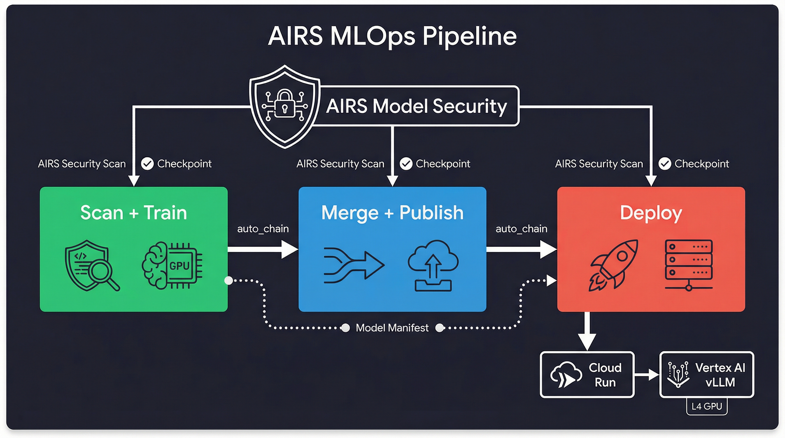
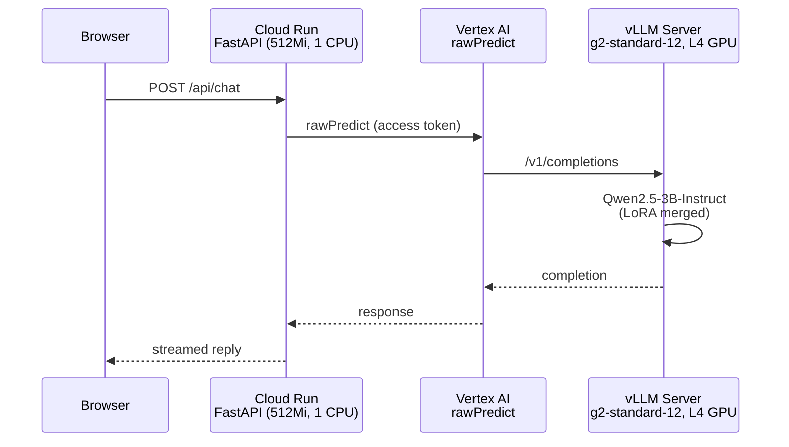

<div align="center">

# Prisma AIRS MLOps Lab

**A secure MLOps pipeline template with AI model security scanning at every gate**

[](LICENSE)
[](https://python.org)
[](https://cloud.google.com)
[](https://www.paloaltonetworks.com/prisma/ai-runtime-security)
[](https://huggingface.co/docs/peft)

[Pipeline](#pipeline) | [Quick Start](#quick-start) | [Architecture](#architecture) | [Security](#security-model) | [Workshop](#workshop)



</div>

---

Production-ready 3-gate CI/CD pipeline for ML models. Fine-tunes a Cloud Security Advisor (Qwen2.5-3B) on Vertex AI with LoRA, scans at every stage with Prisma AIRS Model Security, and serves via a Cloud Run thin client backed by a Vertex AI vLLM endpoint. A model manifest tracks provenance and scan results across all gates.

> **Note:** This is not an official Palo Alto Networks product. Built for instructor-led workshops and provided as-is for reference.

## Features

| | Feature | Description |
|---|---|---|
| :shield: | **AIRS Scanning at Every Gate** | Model security checks before training, after merge, and before deploy |
| :link: | **Automatic Gate Chaining** | Gates trigger sequentially with `auto_chain=true` -- train through deploy in one click |
| :scroll: | **Model Manifest** | JSON provenance record accumulates lineage, scans, and deployment info |
| :rocket: | **Vertex AI + Cloud Run** | GPU inference on vLLM endpoint, thin FastAPI client on Cloud Run |
| :test_tube: | **Poisoning Demo** | Proves AIRS scans structural safety, not behavioral -- includes hands-on proof |
| :mortar_board: | **Workshop Mode** | 8-module guided lab with AI mentor, verification steps, and leaderboard |

## Pipeline

```mermaid
flowchart LR
    subgraph G1["Gate 1: Train"]
        direction LR
        A[Base Model] --> B[AIRS Scan]
        B --> C[LoRA Training<br/>Vertex AI]
        C --> D[Create Manifest]
    end

    subgraph G2["Gate 2: Publish"]
        direction LR
        E[Download Adapter] --> F[Merge with Base]
        F --> G[AIRS Scan]
        G --> H[Publish to GCS]
    end

    subgraph G3["Gate 3: Deploy"]
        direction LR
        I[Verify Manifest] --> J[AIRS Scan]
        J --> K[Deploy Endpoint<br/>vLLM + L4 GPU]
        K --> L[Deploy App<br/>Cloud Run]
    end

    D -- auto_chain --> E
    H -- auto_chain --> I

    style G1 fill:#1a1a2e,stroke:#16213e,color:#e0e0e0
    style G2 fill:#16213e,stroke:#0f3460,color:#e0e0e0
    style G3 fill:#0f3460,stroke:#533483,color:#e0e0e0
```



## Quick Start

> [!NOTE]
> **Prerequisites:** GCP project with Vertex AI + Cloud Run APIs enabled, GCS bucket for model staging, Strata Cloud Manager tenant with AI Runtime Security (Model Security) license, SCM service account credentials, Python 3.10+, and [uv](https://docs.astral.sh/uv/) package manager.

1. **Fork and clone** this repo
2. **Configure secrets** -- copy `.env.example` to `.env`, fill in your values, then add them as GitHub Actions secrets
3. **Replace placeholders** -- search for `your-gcp-project-id`, `your-model-bucket`, and `00000000-0000-0000-0000-00000000000X` across the repo
4. **Run Gate 1** from the Actions tab to scan the base model and train your first LoRA adapter
5. **Enable auto-chaining** (optional) -- set `auto_chain=true` to flow through all three gates automatically

## Pipeline Gates

<details>
<summary><strong>Gate 1: Train Model</strong> -- Manual dispatch, 1-2 hours</summary>

Scans the base model with AIRS, launches LoRA fine-tuning on Vertex AI, and creates a model manifest to track provenance.

| Input | Default | Description |
|-------|---------|-------------|
| `base_model` | `Qwen/Qwen2.5-3B-Instruct` | Base model to fine-tune |
| `base_model_source` | `huggingface_public` | Source: `huggingface_public`, `huggingface_private`, or `gcs` |
| `dataset` | `ethanolivertroy/nist-cybersecurity-training` | Training dataset |
| `max_steps` | `100` | Training steps |
| `machine_type` | `g2-standard-12` | Vertex AI machine: `a2-highgpu-1g` or `g2-standard-12` |
| `skip_scan` | `false` | Skip AIRS scan (not recommended) |
| `auto_chain` | `false` | Trigger Gate 2 on completion |

</details>

<details>
<summary><strong>Gate 2: Publish Model</strong> -- Manual or auto from Gate 1, 15-30 minutes</summary>

Downloads the trained adapter, merges it with the base model, scans the merged artifact with AIRS, and publishes to GCS.

| Input | Default | Description |
|-------|---------|-------------|
| `model_source` | -- | GCS path to trained adapter |
| `model_name` | -- | Published model name |
| `model_version` | -- | Version tag |
| `publish_to` | `gcs` | Registry: `gcs`, `huggingface`, or `vertex_ai` |
| `base_model` | `Qwen/Qwen2.5-3B-Instruct` | Base model for merge |
| `security_group` | -- | Optional AIRS security group UUID |
| `auto_chain` | `false` | Trigger Gate 3 on completion |

</details>

<details>
<summary><strong>Gate 3: Deploy</strong> -- Manual or auto from Gate 2, 30-45 minutes</summary>

Verifies manifest provenance, performs a final AIRS scan, deploys the model to a Vertex AI endpoint with vLLM serving on an L4 GPU, and deploys the FastAPI app to Cloud Run.

| Input | Default | Description |
|-------|---------|-------------|
| `target_env` | `staging` | Environment: `staging` or `production` |
| `model_version` | `latest` | Version tag or `latest` |
| `deployment_strategy` | `full` | Strategy: `full`, `canary`, or `ab_test` |
| `traffic_split` | `100:0` | Traffic split (e.g., `90:10` for canary) |
| `skip_manifest_check` | `false` | Skip provenance verification (emergency only) |

</details>

<details>
<summary><strong>Deploy App</strong> -- Push to main, ~5 minutes</summary>

Lightweight Cloud Run redeploy triggered by code changes on `main`. Does not touch the model or provision GPU resources.

</details>

## Architecture



The app is a thin client -- no model weights, no GPU, no ML dependencies at runtime. Cloud Run handles the web layer; Vertex AI handles inference on dedicated GPU hardware.

## Security Model

> [!IMPORTANT]
> **AIRS scans verify model format and structure** -- serialization safety, known vulnerability patterns, and file integrity. They do **not** detect behavioral issues like data poisoning or backdoors. A model trained on poisoned data will pass all structural scans. This is a known limitation of format-level scanning, not a bug. See the proof-of-concept in [`airs/poisoning_demo/`](airs/poisoning_demo/).

AIRS Model Security is configured through Security Groups in Strata Cloud Manager. Each group defines rules and blocking behavior per source type. The pipeline uses `--warn-only` (non-blocking) scans by default -- scan results are recorded in the manifest, but a failed scan does not halt the pipeline unless you configure blocking rules.

## What's in the Box

```
airs/
  scan_model.py          # AIRS scanner CLI
  poisoning_demo/        # Data poisoning proof-of-concept
model-tuning/            # LoRA fine-tuning + merge scripts for Vertex AI
src/                     # Python package (scanning, serving modules)
scripts/
  manifest.py            # Model manifest CLI (create, verify, show)
  test_airs_sdk.py       # AIRS SDK test harness
  test_inference.py      # Endpoint inference testing
.github/workflows/       # Gate 1, Gate 2, Gate 3, Deploy App
TROUBLESHOOTING.md       # Common issues and fixes
```

## Workshop

> [!TIP]
> Switch to the **`lab`** branch for the guided workshop experience. It includes a Claude Code AI mentor, 8 hands-on modules (from ML fundamentals through pipeline security), per-module verification steps, quizzes, and a live leaderboard. Fork the repo and follow the lab branch README to get started.

## License

MIT -- see [LICENSE](LICENSE).

---

<div align="center">

Built with [Claude Code](https://claude.ai/code)

</div>
