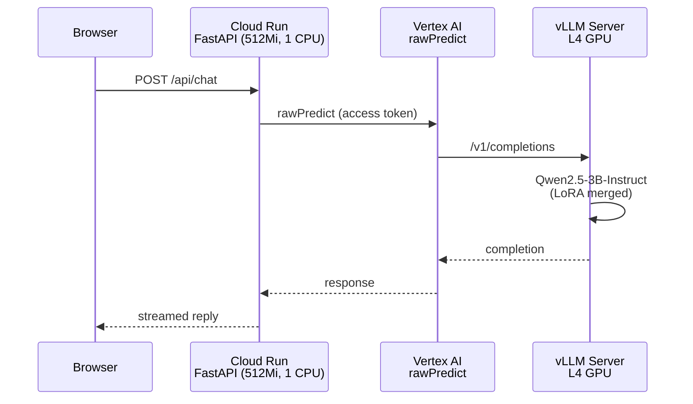

# Lo Que Vas a Construir

El AIRS MLOps Lab es un workshop práctico donde construyes, despliegas y aseguras un pipeline de ML real. Haces fine-tuning de un modelo de lenguaje open-source para convertirlo en un asesor de ciberseguridad, lo despliegas en Google Cloud, y después aseguras sistemáticamente el pipeline usando Palo Alto Networks AI Runtime Security (AIRS).

Esto no es un tutorial pasivo. Trabajas **con Claude Code** como tu compañero de desarrollo y mentor. Claude ha sido configurado específicamente para este lab — conoce el código, adapta el ritmo de sus explicaciones y usa preguntas socráticas para construir tu comprensión.

## Prerrequisitos

Antes de iniciar el lab, asegúrate de tener:

- **Proyecto GCP** — con permisos de owner, APIs de Vertex AI y Cloud Run habilitadas
- **Licencia de AIRS** — acceso a un tenant de Prisma AIRS con credenciales de Strata Cloud Manager
- **Claude Code** — instalado y configurado
- **Cuenta de GitHub** — con `gh` CLI autenticado
- **Python 3.12+** — con `uv` para manejo de dependencias
- **Cuenta de HuggingFace** — para explorar modelos y datasets

Tu instructor proporcionará los detalles del proyecto GCP y las credenciales de AIRS durante la sesión de configuración.

## El Pipeline

Vas a construir un pipeline de CI/CD de 3 gates que escanea modelos de ML en cada etapa:

```mermaid
flowchart LR
    subgraph G1["Gate 1: Train"]
        direction LR
        A[Base Model] --> B[AIRS Scan]
        B --> C[LoRA Training<br/>Vertex AI]
        C --> D[Create Manifest]
    end

    subgraph G2["Gate 2: Publish"]
        direction LR
        E[Download Adapter] --> F[Merge with Base]
        F --> G[AIRS Scan]
        G --> H[Publish to GCS]
    end

    subgraph G3["Gate 3: Deploy"]
        direction LR
        I[Verify Manifest] --> J[AIRS Scan]
        J --> K[Deploy Endpoint<br/>vLLM + L4 GPU]
        K --> L[Deploy App<br/>Cloud Run]
    end

    D -- auto_chain --> E
    H -- auto_chain --> I

    style G1 fill:#1a1a2e,stroke:#16213e,color:#e0e0e0
    style G2 fill:#16213e,stroke:#0f3460,color:#e0e0e0
    style G3 fill:#0f3460,stroke:#533483,color:#e0e0e0
```



**Gate 1** escanea el modelo base antes del entrenamiento, le hace fine-tuning con LoRA en Vertex AI y crea un manifest de procedencia.

**Gate 2** fusiona el adapter LoRA con el modelo base, escanea el artifact fusionado y lo publica en GCS.

**Gate 3** verifica la cadena del manifest, realiza un escaneo final, despliega el modelo en un endpoint de Vertex AI con GPU usando vLLM y despliega la aplicación FastAPI en Cloud Run.

## La Arquitectura

La aplicación desplegada usa una arquitectura desacoplada — el modelo corre en infraestructura con GPU, la aplicación corre en infraestructura ligera:



Sin model weights en el contenedor de Cloud Run. Sin GPU. Sin dependencias de ML en runtime. Cloud Run maneja la capa web; Vertex AI maneja la inferencia en hardware dedicado con GPU.

## La Estructura de Tres Actos

El workshop está organizado en tres actos con una pausa de presentación entre los Actos 1 y 2.

### Acto 1: Constrúyelo (Módulos 0-3)

Construye un pipeline de ML completo desde cero. Al final, tendrás un asesor de ciberseguridad en vivo — entrenado, fusionado, publicado y desplegado. Sin escaneos de seguridad todavía. Eso es intencional.

| Módulo | Enfoque | Tiempo |
|--------|---------|--------|
| [Módulo 0: Configuración](/es/modules#modulo-0-configuracion-del-entorno) | Entorno, GCP, GitHub, credenciales de AIRS | ~30 min |
| [Módulo 1: Fundamentos de ML](/es/modules#modulo-1-fundamentos-de-ml-y-huggingface) | HuggingFace, formatos, datasets, plataformas | ~45 min |
| [Módulo 2: Entrena Tu Modelo](/es/modules#modulo-2-entrena-tu-modelo) | Gate 1, LoRA fine-tuning, Vertex AI | ~30 min + espera |
| [Módulo 3: Despliega y Sirve](/es/modules#modulo-3-despliega-y-sirve) | Gate 2+3, merge, publish, deploy, app en vivo | ~30 min + espera |

### Pausa de Presentación

Sesión dirigida por el instructor: propuesta de valor de AIRS, ataques reales, escenarios con clientes.

### Acto 2: Entiende la Seguridad (Módulo 4)

Inmersión profunda en AIRS Model Security. Configura el acceso, ejecuta escaneos, explora políticas.

| Módulo | Enfoque | Tiempo |
|--------|---------|--------|
| [Módulo 4: Inmersión en AIRS](/es/modules#modulo-4-inmersion-en-airs) | SCM, SDK, escaneo, security groups, integración HF | ~1-1.5 hr |

### Acto 3: Asegúralo (Módulos 5-7)

Asegura el pipeline que construiste. Explora lo que AIRS detecta y lo que no.

| Módulo | Enfoque | Tiempo |
|--------|---------|--------|
| [Módulo 5: Integración de AIRS](/es/modules#modulo-5-integracion-de-airs-al-pipeline) | Escaneo en pipeline, verificación de manifest, etiquetado | ~1-1.5 hr |
| [Módulo 6: El Zoológico de Amenazas](/es/modules#modulo-6-el-zoologico-de-amenazas) | Pickle bombs, trampas Keras, riesgos de formato | ~1 hr |
| [Módulo 7: Brechas y Envenenamiento](/es/modules#modulo-7-brechas-y-envenenamiento) | Envenenamiento de datos, backdoors comportamentales, defensa en profundidad | ~45 min-1 hr |

## Estructura del Proyecto

```
prisma-airs-mlops-lab/
├── .github/
│   ├── workflows/              # Pipeline de CI/CD (3 gates + app deploy)
│   └── pipeline-config.yaml    # Tu proyecto GCP y configuración de buckets
├── src/airs_mlops_lab/
│   └── serving/                # App FastAPI + cliente de inferencia Vertex AI
├── airs/
│   ├── scan_model.py           # CLI de escaneo AIRS
│   └── poisoning_demo/         # Prueba de concepto de envenenamiento de datos
├── model-tuning/
│   ├── train_advisor.py        # Script de fine-tuning con LoRA
│   └── merge_adapter.py        # Merge de adapter para despliegue
├── scripts/
│   └── manifest.py             # CLI de rastreo de procedencia del modelo
├── lab/
│   └── .progress.json          # Tu progreso (rastreado automáticamente)
├── CLAUDE.md                   # Configuración del mentor Claude Code
└── Dockerfile                  # App de Cloud Run (cliente ligero, sin modelo)
```

## Siguiente Paso

¿Listo para configurar? Ve a la [Guía de Configuración del Estudiante](/es/guide/student-setup) para crear tu repo y lanzar Claude Code.
