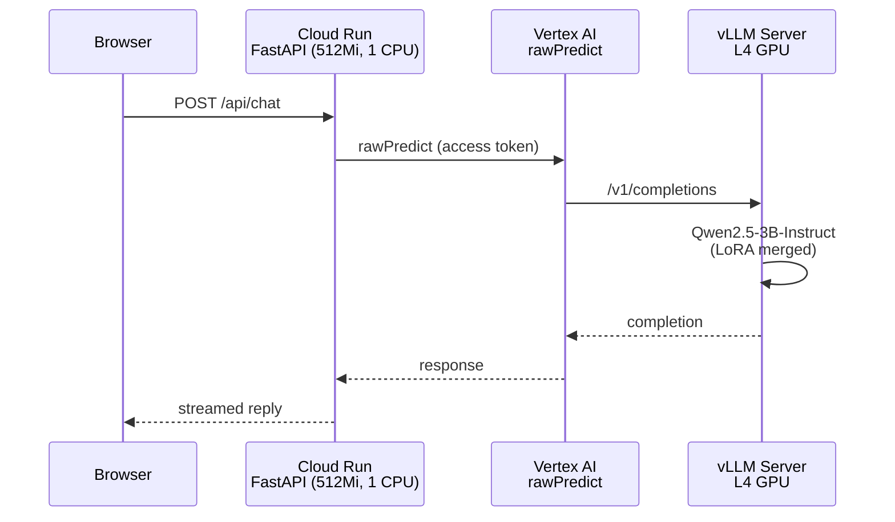

# What You'll Build

The AIRS MLOps Lab is a hands-on workshop where you build, deploy, and secure a real ML pipeline. You fine-tune an open-source language model into a cybersecurity advisor, deploy it on Google Cloud, and then systematically secure the pipeline using Palo Alto Networks AI Runtime Security (AIRS).

This is not a passive tutorial. You work **with Claude Code** as your development partner and mentor. Claude has been configured specifically for this lab -- it knows the codebase, paces its explanations, and uses Socratic questioning to build your understanding.

## Prerequisites

Before starting the lab, ensure you have:

- **GCP Project** -- with owner rights, Vertex AI and Cloud Run APIs enabled
- **AIRS License** -- access to a Prisma AIRS tenant with Strata Cloud Manager credentials
- **Claude Code** -- installed and configured
- **GitHub Account** -- with `gh` CLI authenticated
- **Python 3.12+** -- with `uv` for dependency management
- **HuggingFace Account** -- for exploring models and datasets

Your instructor will provide GCP project details and AIRS credentials during the setup session.

## The Pipeline

You'll build a 3-gate CI/CD pipeline that scans ML models at every stage:

```mermaid
flowchart LR
    subgraph G1["Gate 1: Train"]
        direction LR
        A[Base Model] --> B[AIRS Scan]
        B --> C[LoRA Training<br/>Vertex AI]
        C --> D[Create Manifest]
    end

    subgraph G2["Gate 2: Publish"]
        direction LR
        E[Download Adapter] --> F[Merge with Base]
        F --> G[AIRS Scan]
        G --> H[Publish to GCS]
    end

    subgraph G3["Gate 3: Deploy"]
        direction LR
        I[Verify Manifest] --> J[AIRS Scan]
        J --> K[Deploy Endpoint<br/>vLLM + L4 GPU]
        K --> L[Deploy App<br/>Cloud Run]
    end

    D -- auto_chain --> E
    H -- auto_chain --> I

    style G1 fill:#1a1a2e,stroke:#16213e,color:#e0e0e0
    style G2 fill:#16213e,stroke:#0f3460,color:#e0e0e0
    style G3 fill:#0f3460,stroke:#533483,color:#e0e0e0
```



**Gate 1** scans the base model before training, fine-tunes it with LoRA on Vertex AI, and creates a provenance manifest.

**Gate 2** merges the LoRA adapter with the base model, scans the merged artifact, and publishes to GCS.

**Gate 3** verifies the manifest chain, performs a final scan, deploys the model to a Vertex AI GPU endpoint with vLLM, and deploys the FastAPI app to Cloud Run.

## The Architecture

The deployed application uses a decoupled architecture -- the model runs on GPU infrastructure, the app runs on lightweight infrastructure:



No model weights in the Cloud Run container. No GPU. No ML dependencies at runtime. Cloud Run handles the web layer; Vertex AI handles inference on dedicated GPU hardware.

## The Three-Act Structure

The workshop is organized into three acts with a presentation break between Acts 1 and 2.

### Act 1: Build It (Modules 0-3)

Build a complete ML pipeline from scratch. By the end, you'll have a live cybersecurity advisor -- trained, merged, published, and deployed. No security scans in place yet. That's intentional.

| Module | Focus | Time |
|--------|-------|------|
| [Module 0: Setup](/modules#module-0-environment-setup) | Environment, GCP, GitHub, AIRS credentials | ~30 min |
| [Module 1: ML Fundamentals](/modules#module-1-ml-fundamentals-huggingface) | HuggingFace, formats, datasets, platforms | ~45 min |
| [Module 2: Train Your Model](/modules#module-2-train-your-model) | Gate 1, LoRA fine-tuning, Vertex AI | ~30 min + wait |
| [Module 3: Deploy & Serve](/modules#module-3-deploy-serve) | Gate 2+3, merge, publish, deploy, live app | ~30 min + wait |

### Presentation Break

Instructor-led session: AIRS value proposition, real-world attacks, customer scenarios.

### Act 2: Understand Security (Module 4)

Deep dive into AIRS Model Security. Set up access, run scans, explore policies.

| Module | Focus | Time |
|--------|-------|------|
| [Module 4: AIRS Deep Dive](/modules#module-4-airs-deep-dive) | SCM, SDK, scanning, security groups, HF integration | ~1-1.5 hr |

### Act 3: Secure It (Modules 5-7)

Secure the pipeline you built. Explore what AIRS catches and what it doesn't.

| Module | Focus | Time |
|--------|-------|------|
| [Module 5: Integrate AIRS](/modules#module-5-integrate-airs-into-pipeline) | Pipeline scanning, manifest verification, labeling | ~1-1.5 hr |
| [Module 6: The Threat Zoo](/modules#module-6-the-threat-zoo) | Pickle bombs, Keras traps, format risks | ~1 hr |
| [Module 7: Gaps & Poisoning](/modules#module-7-gaps-poisoning) | Data poisoning, behavioral backdoors, defense in depth | ~45 min-1 hr |

## Project Structure

```
prisma-airs-mlops-lab/
├── .github/
│   ├── workflows/              # CI/CD pipeline (3 gates + app deploy)
│   └── pipeline-config.yaml    # Your GCP project and bucket config
├── src/airs_mlops_lab/
│   └── serving/                # FastAPI app + Vertex AI inference client
├── airs/
│   ├── scan_model.py           # AIRS scanning CLI
│   └── poisoning_demo/         # Data poisoning proof-of-concept
├── model-tuning/
│   ├── train_advisor.py        # LoRA fine-tuning script
│   └── merge_adapter.py        # Adapter merge for deployment
├── scripts/
│   └── manifest.py             # Model provenance tracking CLI
├── lab/
│   └── .progress.json          # Your progress (tracked automatically)
├── CLAUDE.md                   # Claude Code mentor configuration
└── Dockerfile                  # Cloud Run app (thin client, no model)
```

## Next Step

Ready to set up? Head to the [Student Setup Guide](/guide/student-setup) to create your repo and launch Claude Code.
