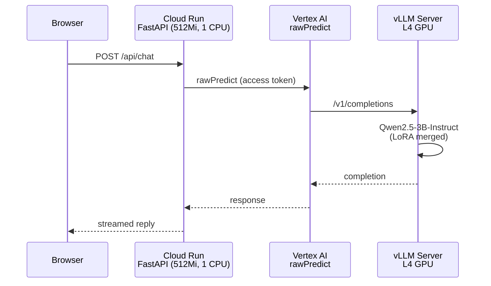

# O Que Você Vai Construir

O AIRS MLOps Lab é um workshop prático onde você constrói, implanta e protege um pipeline de ML real. Você faz fine-tuning de um modelo de linguagem open-source para transformá-lo em um consultor de cibersegurança, implanta no Google Cloud, e depois protege sistematicamente o pipeline usando Palo Alto Networks AI Runtime Security (AIRS).

Isso não é um tutorial passivo. Você trabalha **com o Claude Code** como seu parceiro de desenvolvimento e mentor. O Claude foi configurado especificamente para este lab — ele conhece o código, adapta o ritmo das suas explicações e usa perguntas socráticas para construir sua compreensão.

## Pré-requisitos

Antes de iniciar o lab, garanta que você tem:

- **Projeto GCP** — com permissões de owner, APIs de Vertex AI e Cloud Run habilitadas
- **Licença de AIRS** — acesso a um tenant de Prisma AIRS com credenciais de Strata Cloud Manager
- **Claude Code** — instalado e configurado
- **Conta no GitHub** — com `gh` CLI autenticado
- **Python 3.12+** — com `uv` para gerenciamento de dependências
- **Conta no HuggingFace** — para explorar modelos e datasets

Seu instrutor fornecerá os detalhes do projeto GCP e as credenciais do AIRS durante a sessão de configuração.

## O Pipeline

Você vai construir um pipeline de CI/CD de 3 gates que escaneia modelos de ML em cada etapa:

```mermaid
flowchart LR
    subgraph G1["Gate 1: Train"]
        direction LR
        A[Base Model] --> B[AIRS Scan]
        B --> C[LoRA Training<br/>Vertex AI]
        C --> D[Create Manifest]
    end

    subgraph G2["Gate 2: Publish"]
        direction LR
        E[Download Adapter] --> F[Merge with Base]
        F --> G[AIRS Scan]
        G --> H[Publish to GCS]
    end

    subgraph G3["Gate 3: Deploy"]
        direction LR
        I[Verify Manifest] --> J[AIRS Scan]
        J --> K[Deploy Endpoint<br/>vLLM + L4 GPU]
        K --> L[Deploy App<br/>Cloud Run]
    end

    D -- auto_chain --> E
    H -- auto_chain --> I

    style G1 fill:#1a1a2e,stroke:#16213e,color:#e0e0e0
    style G2 fill:#16213e,stroke:#0f3460,color:#e0e0e0
    style G3 fill:#0f3460,stroke:#533483,color:#e0e0e0
```



**Gate 1** escaneia o modelo base antes do treinamento, faz fine-tuning com LoRA no Vertex AI e cria um manifest de procedência.

**Gate 2** funde o adapter LoRA com o modelo base, escaneia o artifact fundido e publica no GCS.

**Gate 3** verifica a cadeia do manifest, realiza um escaneamento final, implanta o modelo em um endpoint de Vertex AI com GPU usando vLLM e implanta a aplicação FastAPI no Cloud Run.

## A Arquitetura

A aplicação implantada usa uma arquitetura desacoplada — o modelo roda em infraestrutura com GPU, a aplicação roda em infraestrutura leve:



Sem model weights no container do Cloud Run. Sem GPU. Sem dependências de ML em runtime. O Cloud Run cuida da camada web; o Vertex AI cuida da inferência em hardware dedicado com GPU.

## A Estrutura de Três Atos

O workshop está organizado em três atos com uma pausa de apresentação entre os Atos 1 e 2.

### Ato 1: Construa (Módulos 0-3)

Construa um pipeline de ML completo do zero. No final, você terá um consultor de cibersegurança ao vivo — treinado, fundido, publicado e implantado. Sem escaneamentos de segurança ainda. Isso é intencional.

| Módulo | Foco | Tempo |
|--------|------|-------|
| [Módulo 0: Configuração](/pt/modules#modulo-0-configuracao-do-ambiente) | Ambiente, GCP, GitHub, credenciais do AIRS | ~30 min |
| [Módulo 1: Fundamentos de ML](/pt/modules#modulo-1-fundamentos-de-ml-e-huggingface) | HuggingFace, formatos, datasets, plataformas | ~45 min |
| [Módulo 2: Treine Seu Modelo](/pt/modules#modulo-2-treine-seu-modelo) | Gate 1, LoRA fine-tuning, Vertex AI | ~30 min + espera |
| [Módulo 3: Implante e Sirva](/pt/modules#modulo-3-implante-e-sirva) | Gate 2+3, merge, publish, deploy, app ao vivo | ~30 min + espera |

### Pausa de Apresentação

Sessão conduzida pelo instrutor: proposta de valor do AIRS, ataques reais, cenários com clientes.

### Ato 2: Entenda a Segurança (Módulo 4)

Mergulho profundo no AIRS Model Security. Configure o acesso, execute escaneamentos, explore políticas.

| Módulo | Foco | Tempo |
|--------|------|-------|
| [Módulo 4: Mergulho no AIRS](/pt/modules#modulo-4-mergulho-no-airs) | SCM, SDK, escaneamento, security groups, integração HF | ~1-1.5 hr |

### Ato 3: Proteja (Módulos 5-7)

Proteja o pipeline que você construiu. Explore o que o AIRS detecta e o que não detecta.

| Módulo | Foco | Tempo |
|--------|------|-------|
| [Módulo 5: Integração do AIRS](/pt/modules#modulo-5-integracao-do-airs-ao-pipeline) | Escaneamento no pipeline, verificação de manifest, rotulação | ~1-1.5 hr |
| [Módulo 6: O Zoológico de Ameaças](/pt/modules#modulo-6-o-zoologico-de-ameacas) | Pickle bombs, armadilhas Keras, riscos de formato | ~1 hr |
| [Módulo 7: Lacunas e Envenenamento](/pt/modules#modulo-7-lacunas-e-envenenamento) | Envenenamento de dados, backdoors comportamentais, defesa em profundidade | ~45 min-1 hr |

## Estrutura do Projeto

```
prisma-airs-mlops-lab/
├── .github/
│   ├── workflows/              # Pipeline de CI/CD (3 gates + app deploy)
│   └── pipeline-config.yaml    # Seu projeto GCP e configuração de buckets
├── src/airs_mlops_lab/
│   └── serving/                # App FastAPI + cliente de inferência Vertex AI
├── airs/
│   ├── scan_model.py           # CLI de escaneamento AIRS
│   └── poisoning_demo/         # Prova de conceito de envenenamento de dados
├── model-tuning/
│   ├── train_advisor.py        # Script de fine-tuning com LoRA
│   └── merge_adapter.py        # Merge de adapter para implantação
├── scripts/
│   └── manifest.py             # CLI de rastreamento de procedência do modelo
├── lab/
│   └── .progress.json          # Seu progresso (rastreado automaticamente)
├── CLAUDE.md                   # Configuração do mentor Claude Code
└── Dockerfile                  # App do Cloud Run (cliente leve, sem modelo)
```

## Próximo Passo

Pronto para configurar? Vá para o [Guia de Configuração do Estudante](/pt/guide/student-setup) para criar seu repo e iniciar o Claude Code.
